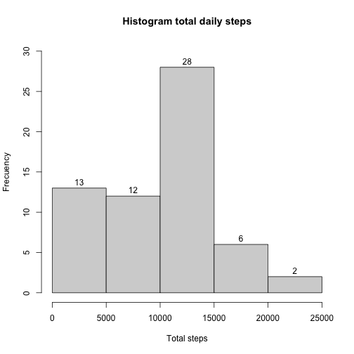
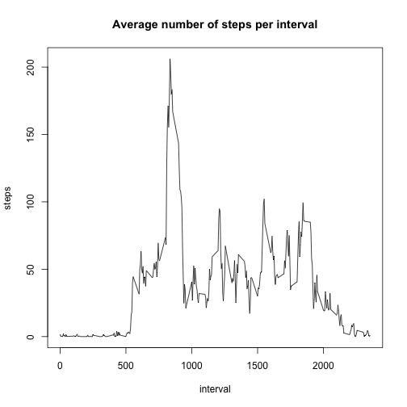
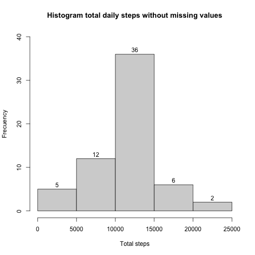
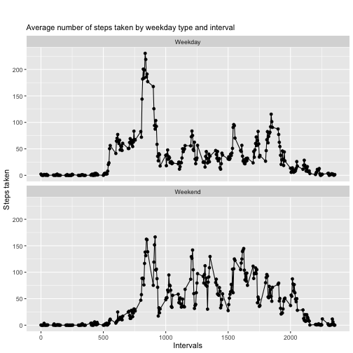

Reproducible Research  

Loading libraries and data directly from URL + Unzip

```r
library(utils)
library(ggplot2)
library(dplyr)
url<- "https://d396qusza40orc.cloudfront.net/repdata%2Fdata%2Factivity.zip"
if(!file.exists("./data")) {
    dir.create("./data")
}
download.file(url,destfile = "./data/Factivity.zip")
unzip(zipfile = "./data/Factivity.zip",exdir = "./data")
```
  
Loading data into a data frame using the read.csv function 

```r
data <-read.csv("./data/activity.csv")
```
  
Formatting date field and plotting histogram of total steps taken each day

```r
data <- mutate(data, date=as.Date(date, "%Y-%m-%d"))
totals.daily <-with(data, tapply(steps, date,sum,na.rm=TRUE ))
hist(totals.daily, labels = TRUE, ylim = c(0, 30), xlab = "Total steps", ylab = "Frecuency", main = "Histogram total daily steps")
```


  
Calculating mean and median number of steps taken each day 

```r
mean.daily <- format(mean(totals.daily), nsmall =2)
median.daily <- format(median(totals.daily), nsmall =2)
```
The daily mean steps is 9354.23 steps and the median daily is 10395 steps
  
Daily average activity pattern by 5-minute interval

```r
means.interval <-with(data, tapply(steps, interval,mean, na.rm=TRUE ))
plot(names(means.interval),means.interval, xlab="interval", ylab = "steps", type="l", main = "Average number of steps per interval")
```



```r
maxsteps<- data$interval[which.max(means.interval)]
```
On average across all days in the dataset, the interval 835 contains the maximum number of average steps taken   

Calculating missing values

```r
missed.total<- sum(is.na(data))
missed.percent<- format(mean(is.na(data))*100, digits = 3)
```
The total number of missing values is 2304 which is a 4.37 percent of total samples  

Filling missed values  
The missed values were found only in the steps column as expected  
The missed values were concentrated in specific days mostly and not in specific intervals  
Due to these above reasons, the chosen strategy to fill missed values is to fill the missed steps with the average steps taken in that specific interval

```r
data.f <- group_by(data, interval)
data.f <- mutate(data.f, steps=ifelse(is.na(steps), mean(steps, na.rm=TRUE), steps))
totals.daily.f <-with(data.f, tapply(steps, date,sum,na.rm=TRUE ))
hist(totals.daily.f, labels = TRUE, ylim = c(0, 40), xlab = "Total steps", ylab = "Frecuency", main = "Histogram total daily steps without missing values")
```



```r
mean.daily.f <- format(mean(totals.daily.f))
median.daily.f <- format(median(totals.daily.f))
```
  

The daily mean steps is 10766.19 steps and the median daily is 10766.19 steps which is different from The daily mean of 9354.23 steps and the median daily of 10395 steps from the data with missing values   

Differences in activity patterns between weekdays and weekends

```r
data.f <- mutate(data.f, weekday=factor(weekdays(date),levels=c("Monday", "Tuesday", "Wednesday", "Thursday", "Friday", "Saturday","Sunday"),
                                        labels = c(rep("Weekday",5),rep("Weekend",2))))

data.f <- group_by(data.f, interval, weekday)
data.f<- summarise(data.f, steps.means=mean(steps))
```

```
## `summarise()` regrouping output by 'interval' (override with `.groups` argument)
```

```r
ggplot(data.f, aes(interval,steps.means))+ geom_point()+ geom_line() +
    facet_wrap(~weekday, ncol=1)+ labs(subtitle = "Average number of steps taken by weekday type and interval")+ 
    xlab('Intervals')+ylab('Steps taken') + theme(plot.margin = unit(c(35,5,5,5), "pt"))
```


